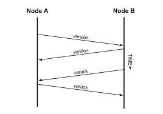
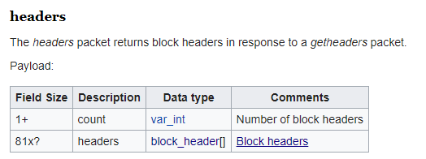
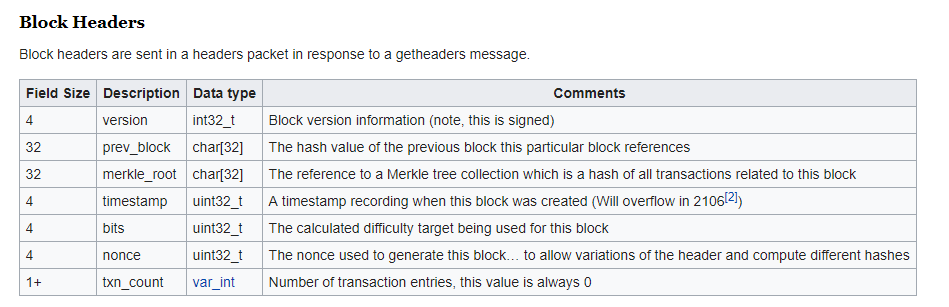
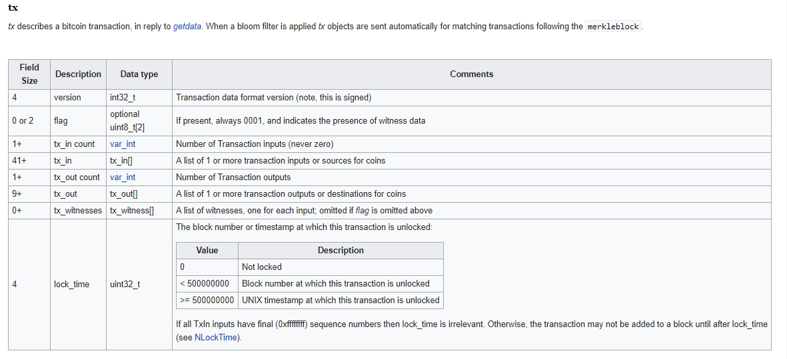
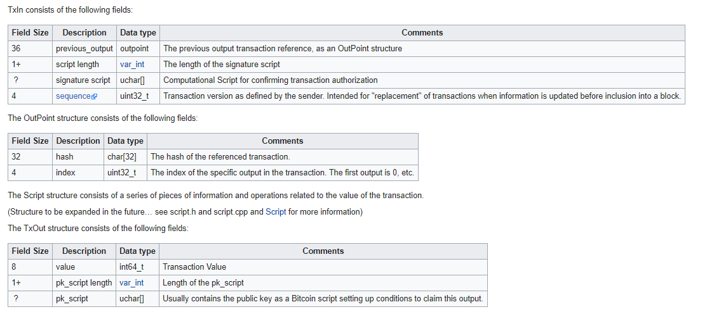
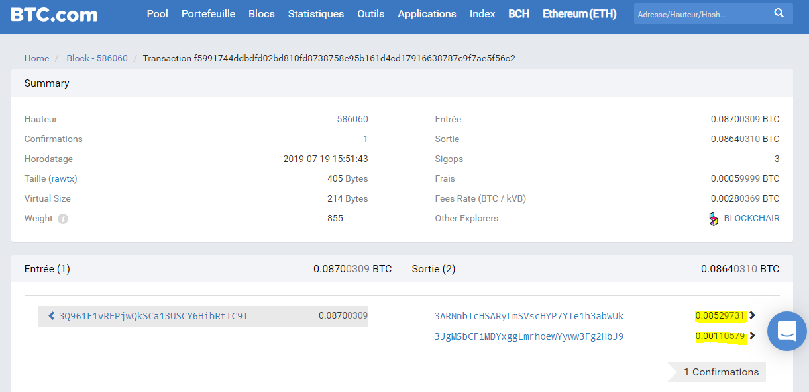

# Cryptio_btc_block_bg_checker
 
# Background:
With this project, we would like to code a program that tracks an **entity transaction real time data** given their unspent transaction hash 
(i.e. the hash of the last transactions they have). This can have a lot of possible applications, one of them is to be able to track *your own* transaction and see whether it is
already succesfully saved in the global ledger, you can also track peoples transaction if you know who the unspent transaction hash belongs to.
What is ambitious about this project is we would like to do this **without running our own node** and use as least as third party API as possible such as blockchain API, with that being 
said we will eventually use their API for one small part of the project which will be explained later. All communication in the bitcoin protocol uses TCP Protocol.

## Why not run our own node?

There is no doubt that running your own bitcoin node is beneficial if you are a bitcoin player, some might say it is recommended. Unfortunately running your own node comes with 
cost which mainly comes from having to keep the whole bitcoin blockchain stored in your device. And that way is also beneficial for us to learn about the bitcoin Peer2Peer protocol.

## Why not use the existing API for the whole project?

This project is meant to help Cryptio and as a startup that dreams big we will need to think of a scalable method, thus relying a lot on a third party API will put us on a restrictive
disadvantage in the long run.

Outline of steps that we will take:
- *Connecting to a remote node*
- *handshake*
- *get headers message*
- *get block message*
- *handle packets*

Special thanks to justin moon's [repo](https://github.com/justinmoon/bitcoincorps) for having a thorough step by step guide on communicating to a remote node. 
do check it out if you wanna go deeper than what we cover here!


## Dependencies:
	-binsacii
	-blockchain
	-python3 (not tested for python2)
	-other libraries that we use will should be in the python standard package library, if not:
		-hashlib
		-codecs
		-io
		-re
		-socket

# A remote node

in <https://bitnodes.earn.com/nodes/>, you can find a variety of public bitcoin node which you can connect to


# Handshake

Best way to think of this _Handshake_ is like in real life it is *socially wise* to handshake someone before a professional meeting and tells them your name, company, etc. except with
the bitcoin network, your peer will not want to talk to you ever if you haven't done the handshake.
The purpose of this handshake ritual is to broadcast your identity to your connected peer.



The _Handshake_ done by the following:

	- We send a Version message
	- We receive a Version message
	- We receive a Verack (VERsion ACKnowledgement) message
	- We send a Verack message 

#### ref :
version : <https://en.bitcoin.it/wiki/Protocol_documentation#version>

verack : <https://en.bitcoin.it/wiki/Protocol_documentation#verack>
	
# Get Headers Message

Every block is represented in the blockchain(*in the node*) as a blockheaders. There is no use for a node to keep the data of all the transaction in each block unless it is in
their interest.

If we take a look at the format of a response to a *get headers message* from the bitcoin protocol, we can see that the actual block it self is crypted in the second part of the headers message,
this means we can get the details of the block, if we can decode it using binary parsing.

#### ref :
getheaders : <https://en.bitcoin.it/wiki/Protocol_documentation#getheaders>

# Get Block Message

In this step we request the details of the *block message* from the *headers message* through our public node. The information that we are most interested in is the transactions that
are included in the block

#### ref :
getblocks : <https://en.bitcoin.it/wiki/Protocol_documentation#getblocks>

# Handle Packets

There are 2 main packets that we will be interested in. I specified only 2 because throughout the communication protocol we will also receive other packets such as *inv* packets, 
*getaddr* packets or a *ping* message which doesnt do us any good.



## Handling headers message:

Headers message is the response to a *getheaders* message that we sent, which should contain the information about the block headers we requested.

#### ref :
headers : <https://en.bitcoin.it/wiki/Protocol_documentation#headers>

block headers : <https://en.bitcoin.it/wiki/Protocol_documentation#Block_Headers>




## Handling block message:

A block message is a response to a getblocks message and contains the information about the block. As we can see the information about the 
transactions is in the very last chunk of bytes.

The transaction object contained has a list of inputs and outputs, **now do not get confused!** contrary to our usual notion of inputsan d outputs being the addresses of 
the entity that take part in the transaction, 
that is not the case in the bitcoin protocol , instead input contains the **unspent transaction hash** that the user have that he/she used in this transaction
and output contains the information about the **amount** of the transaction in satoshi, with that being said, technically we can derive the 
address of the recepient and sender of the transaction by studying the script in the output but in our case we will not go as deep. 
so the conclusion is if we managed to decode this message to get the details of the transaction in the block, given an unspent transaction hash, we can scan the block
for when is our unspent transaction hash is used as an input in a transaction and when it does, we can catch it and find details about how much they spent etc.
 
  
 
# Practical Tutorial

For the sake of example we will use the most recent block (19/07/2019 03:52 PM Paris time), and *by assumption* we know that our friend Bob has an unspent transaction belonging to his address with 
hash : 1081a6210c4bb133e52c01fae7d713e6245f57df3abafc69ed3539a922b53d30.

First we can get the most recent block hash by calling the function `recent_hash()`, here is an example:

```
from bitcoin_block_bg_checker.main import block_search, recent_hash

block_hash = recent_hash()
print(block_hash)

```
which returns:
```
00000000000000000016c21dbaf2c993140fb23bd1dce3f6a023e639cb2177e3
```

Perfect! now we need to have a feeling that Bob has spend some btc in this block. To check we can do a quick block search:

```
txn = block_search(("91.121.170.214", 8333), #remote public nodes, can be found in https://bitnodes.earn.com/nodes/
		block_hash,
                target_unspent_tx="82e63e889759bccc0561d771c657fb0e451bd3b750d5735535f8c770891c1a46")
```

which will return

```
discarding "b'sendheaders'"
discarding "b'sendcmpct'"
discarding "b'sendcmpct'"
discarding "b'ping'"
discarding "b'addr'"
discarding "b'getheaders'"
discarding "b'feefilter'"
handling "b'headers'"
0 new headers
We now have 1 headers
handling "b'block'"
<Tx new 
 ntx_ins: <TxIn 0000000000000000000000000000000000000000000000000000000000000000> 
 tx_outs: <Amount 1338263819>,<Amount 0>,<Amount 0>> 

<Tx new 
 ntx_ins: <TxIn 03319d4cbaea65c348839469af0251f5d03bf708a4b949830560968d88ca3494> 
 tx_outs: <Amount 122275407>> 

<Tx new 
 ntx_ins: <TxIn cf46617c477699dad42ff5b2bd9977d2aa2b53f7145b97e26cedd0b3765caa54> 
 tx_outs: <Amount 0>,<Amount 10484270>,<Amount 406000000>> 

<Tx new 
 ntx_ins: <TxIn 30a907a3afe002fb680240f82b1067078eb33c03fae787ee7e728677cdb9e639>,<TxIn 0309dea05c7d9cb3548a6397f00ee1f08fc8d64af840a728f5c577e3c02ca357>,<TxIn a8cd82b15a3776fbb51259f2b637eaba78cc5144d25270ddc9146f8263befb85>,<TxIn 075a1262cb76a19caf046f64d70149fb0117cacbeed65f5111148ffe10db27b9>,<TxIn a8c5c92ffe9a61009aed892c83d2cb25ec56f0059a45f0dc9d515b423d6028be>,<TxIn a56824285fa4fd70fd79270e10950ed08f9bfcfeb90c0dc98788d6cbfce1d5c2>,<TxIn 74abad6dc347e0e372cefa3e0a31f40bf7e27e0364164f1a10f488ec0cc3d6c2>,<TxIn 8881b4f713ce67d3f066fe1aab31b03f663dc7b4bf3b0a5a14e39f3009e0ecc6>,<TxIn 033971f2c27cc5c38f49ea2ec1674da5fefaeda37bed9cf0e273876b015363c7> 
 tx_outs: <Amount 200000000>,<Amount 969071>> 

<Tx new 
 ntx_ins: <TxIn 5b935f610a98629f8c2924ab8e29baaea59ce2990910663bea53430c6114d2bb> 
 tx_outs: <Amount 70105604>,<Amount 500000000>> 

<Tx new 
 ntx_ins: <TxIn d3e38eeaefb0023950febf396c46e5c074166d3c7b3519e1c6c041f0cc08332e> 
 tx_outs: <Amount 2867667>,<Amount 17299314>> 

<Tx new 
 ntx_ins: <TxIn 0ec2ba763cc9cac33ddd6b4d796ee036540b21d21aa01a86ab4aabf6fbec4c96> 
 tx_outs: <Amount 0>,<Amount 190184>> 

<Tx new 
 ntx_ins: <TxIn c7b5a80fa413bdcf3f106b747233e2b156e104915b585662d69bdfad8d948dee> 
 tx_outs: <Amount 193985>,<Amount 3668360>> 
.
.
.
.
.

<Tx new 
 ntx_ins: <TxIn 2e144c771408f94cf25f1e3bacb5d0dd93f78800d06efdfe9ec2c4bf6524fffa> 
 tx_outs: <Amount 114570000>,<Amount 1653463610>> 

<Tx new 
 ntx_ins: <TxIn 3b171fb5d61f9f8206543a9a192c68335af5b0c44164fc686f51b54997ca7142> 
 tx_outs: <Amount 102730>> 

<Tx new 
 ntx_ins: <TxIn afff03af637cdc9032a61c6b7b1a907dd90b57049aaca4c69256e9a0957b1a63> 
 tx_outs: <Amount 2184>,<Amount 0>,<Amount 546>> 

<Tx new 
 ntx_ins: <TxIn 4465c145efcb2335c09fb3c9948efbc918f38bdfeb532f468de35a207472839c> 
 tx_outs: <Amount 380700>> 

<Tx new 
 ntx_ins: <TxIn 93873ab6afc5294f6408817e40a442d042e16597bd1e200cf53f7a8f9074883f> 
 tx_outs: <Amount 246000>,<Amount 1085434>,<Amount 2166000>,<Amount 3479308>,<Amount 13131861144>> 

<Tx new 
 ntx_ins: <TxIn ced10956c18ac1c86b16d77137056cc5a1a4b8139a10d6e746cfa8b3e3b79533> 
 tx_outs: <Amount 16565031>,<Amount 628525>> 

<Tx new 
 ntx_ins: <TxIn 82e63e889759bccc0561d771c657fb0e451bd3b750d5735535f8c770891c1a46> 
 tx_outs: <Amount 8529731>,<Amount 110579>> 

82e63e889759bccc0561d771c657fb0e451bd3b750d5735535f8c770891c1a46
new_transaction detected from unspent transaction 82e63e889759bccc0561d771c657fb0e451bd3b750d5735535f8c770891c1a46

```

Great, the algorithm found the target! So now we have a transaction object under the variable txn, thus if we do:

```
for each_output in txn.tx_outs:
    print(each_output.amount, " satoshi")
```


which returns 

```
8529731  satoshi
110579  satoshi
```
which corresponds perfectly with the data in the blockchain info or btc.com


Here are a little documentation of what each class consists of:

```
Tx:
    version
    tx_ins
    tx_outs
    locktime
    testnet

TxIn:
    prev_tx
    prev_index
    script_sig
    sequence

TxOut:
    amount
    script_pubkey
```

# Conclusion

This project enables us to to track an unspent transaction through only socket connection with a remote node.